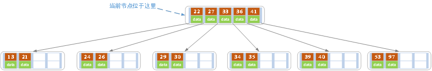
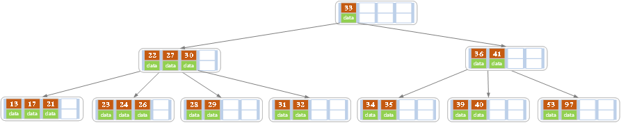
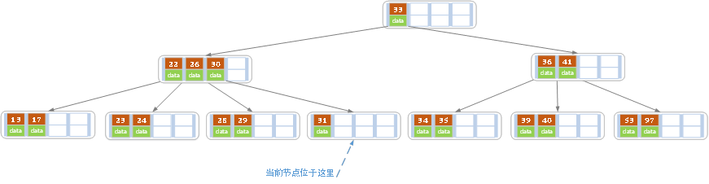

### 一、平衡二叉树

#### 1. 概念

AVL树是带有平衡条件的二叉查找树。**它要求在AVL树中任何节点的两个子树的高度(高度是指节点到一片树叶的最长路径的长) 最大差别为1**。

#### 2. 特点：

平衡二叉树是采用二分法思维把数据按规则组装成一个树形结构的数据，用这个树形结构的数据减少无关数据的检索，大大的提升了数据检索的速度；平衡二叉树的数据结构组装过程有以下规则：

1. 非叶子节点只能允许最多两个子节点存在。
2. 每一个非叶子节点数据分布规则为左边的子节点小当前节点的值，右边的子节点大于当前节点的值(这里值是基于自己的算法规则而定的，比如hash值)；

平衡树的层级结构：因为平衡二叉树查询性能和树的层级（h高度）成反比，h值越小查询越快、为了保证树的结构左右两端数据大致平衡降低二叉树的查询难度一般会采用一种算法机制实现节点数据结构的平衡，实现了这种算法的有比如Treap、红黑树，使用平衡二叉树能保证数据的左右两边的节点层级相差不会大于1，通过这样避免树形结构由于删除增加变成线性链表影响查询效率，保证数据平衡的情况下查找数据的速度近于二分法查找；

总结：

1. 非叶子节点最多拥有两个子节点；
2. 非叶子节值大于左边子节点、小于右边子节点；
3. 树的左右两边的层级数相差不会大于1；
4. 没有值相等重复的节点；

#### 3. 添加节点

当我们执行插入一个节点时，很可能会破坏AVL树的平衡特性，所以我们需要调整AVL树的结构，使其重新平衡，而调整的方式称之为**旋转**。

这里我们**针对父节点的位置**分为**左-左**，**左-右**，**右-右**，**右-左**这4类情况分析，而对**左-左**，**右-右**情况进行**单旋转**，也就是一次旋转，对**左-右**，**右-左**情况进行**双旋转**，两次旋转，最终恢复其平衡特性。

- 左左

  

- 左右

  

- 右右

  

- 右左

  

#### 4. 节点删除

对于二叉平衡树的删除节点操作，可以分成两步：

1. 删除节点，并且保证依然是一棵二叉排序树
2. 对二叉平衡树进行调整，保证是一棵平衡二叉树

对于第二步，在将删除节点和插入节点导致的非平衡问题中，最小非平衡子树类型的判断方法进行了统一后，实际上，对删除节点导致失衡问题的调整和对于添加节点导致的失衡问题的调整，方法也就统一了！

**所以重点在第一步，即：删除节点，并且保证依然是一棵二叉排序树。**

当删除一个节点时，该节点的孩子们怎么分配十分关键，因为要保证依然是一棵二叉排序树。

根据待删除节点的孩子的分布特点，可以将待删除节点分成三种类型，我们设待删除的节点为todelete：

1.  todelete没有孩子，这种情况最简单了，直接把它删了就好，因为它没有孩子要分配。
2. todelete只有一个孩子，这种情况也比较简单，用这个唯一的孩子将todelete取代了就好，所谓子承父业。
3.  todelete有两个孩子，这种情况就比较复杂了。俗话说一碗水端不平，究竟将自己的皇位传给哪个孩子呢？这可是个严肃的问题！中国古代讲究宗法制，血统很重要，按照宗法制，皇位最合法的继承者就是嫡长子！那在二叉排序树中谁是todelete的嫡长子呢？答案是todelete的后继节点，也就是比todelete大的节点中的最小的那一个！看到了吧，为什么当初起名字的时候要叫它后继节点呢。人家是要继承皇位哒！
   太子继承了皇位，那太子的位置就空了，这个时候就需要有人来继承太子的位置，那个人就是原太子的右孩子。好把，我们形式化一下，设todelete的后继节点为y，y的右孩子为x（注意y是没有左孩子的，因为如果存在左孩子那他的左孩子就是后继节点，继承皇位就没他什么事儿啦！）。这个时候，如果x为NULL那么，将todelete用y的替换，然后释放原来的y空间即可。如果x存在，那么用y替换了todelete后，还要用x替换y，然后释放原来x的空间，也就是太子成为皇帝，太子的儿子成为太子，然后太子的儿子的位置就空了，空了就清理了！

### 二、B/B-树

#### 1. 概念

B树和平衡二叉树稍有不同的是B树属于多叉树又名平衡多路查找树（查找路径不只两个）。

#### 2. 定义

一颗m阶的B树定义如下：

- 每个结点最多有m-1个关键字。
- 根结点最少可以只有1个关键字。
- 非根结点至少有Math.ceil(m/2)-1个关键字。
- 每个结点中的关键字都按照从小到大的顺序排列，每个关键字的左子树中的所有关键字都小于它，而右子树中的所有关键字都大于它。
- 所有叶子结点都位于同一层，或者说根结点到每个叶子结点的长度都相同。

上图是一颗阶数为4的B树。在实际应用中的B树的阶数m都非常大（通常大于100），所以即使存储大量的数据，B树的高度仍然比较小。每个结点中存储了关键字（key）和关键字对应的数据（data），以及孩子结点的指针。**我们将一个key和其对应的data称为一个记录**。**下文就用key来代替（key, value）键值对这个整体**。在数据库中我们将B树（和B+树）作为索引结构，可以加快查询速速，此时B树中的key就表示键，而data表示了这个键对应的条目在硬盘上的逻辑地址。

#### 3. 特点

B树相对于平衡二叉树的不同是，每个节点包含的关键字增多了，特别是在B树应用到数据库中的时候，数据库充分利用了磁盘块的原理（磁盘数据存储是采用块的形式存储的，每个块的大小为4K，每次IO进行数据读取时，同一个磁盘块的数据可以一次性读取出来）把节点大小限制和充分使用在磁盘快大小范围；把树的节点关键字增多后树的层级比原来的二叉树少了，减少数据查找的次数和复杂度。

#### 4. 添加节点

插入操作是指插入一条记录，即（key, value）的键值对。如果B树中已存在需要插入的键值对，则用需要插入的value替换旧的value。若B树不存在这个key,则一定是在叶子结点中进行插入操作。

1. 根据要插入的key的值，找到叶子结点并插入。
2. 判断当前结点key的个数是否小于等于m-1，若满足则结束，否则进行第3步。
3. 以结点中间的key为中心分裂成左右两部分，然后将这个中间的key插入到父结点中，这个key的左子树指向分裂后的左半部分，这个key的右子支指向分裂后的右半部分，然后将当前结点指向父结点，继续进行第3步。

下面以5阶B树为例，介绍B树的插入操作，在5阶B树中，结点最多有4个key,最少有2个key

1. 在空树中插入39，此时根结点就一个key，此时根结点也是叶子结点

   ![clip_image002[4]](image/834468-20180406232637766-945625689.png)

2. 继续插入22，97和41，根结点此时有4个key

   

3. 继续插入53

   

   插入后超过了最大允许的关键字个数4，所以以key值为41为中心进行分裂，结果如下图所示，分裂后当前结点指针指向父结点，满足B树条件，插入操作结束。当阶数m为偶数时，需要分裂时就不存在排序恰好在中间的key，那么我们选择中间位置的前一个key或中间位置的后一个key为中心进行分裂即可。

   

4. 依次插入13，21，40，同样会造成分裂，结果如下图所示。

   

5. 依次插入30，27, 33 ；36，35，34 ；24，29，结果如下图所示。

   

6. 插入key值为26的记录，插入后的结果如下图所示。

   

   当前结点需要以27为中心分裂，并向父结点进位27，然后当前结点指向父结点，结果如下图所示。

   

   进位后导致当前结点（即根结点）也需要分裂，分裂的结果如下图所示。

   

   分裂后当前结点指向新的根，此时无需调整。

7. 最后再依次插入key为17,28,29,31,32的记录，结果如下图所示。

   

8. **注意：**

   一般来说，对于确定的m和确定类型的记录，结点大小是固定的，无论它实际存储了多少个记录。但是分配固定结点大小的方法会存在浪费的情况，比如key为28,29所在的结点，还有2个key的位置没有使用，但是已经不可能继续在插入任何值了，因为这个结点的前序key是27,后继key是30,所有整数值都用完了。所以如果记录先按key的大小排好序，再插入到B树中，结点的使用率就会很低，最差情况下使用率仅为50%。

#### 5. 删除节点

删除操作是指，根据key删除记录，如果B树中的记录中不存对应key的记录，则删除失败。

1. 如果当前需要删除的key位于非叶子结点上，则用后继key（这里的后继key均指后继记录的意思）覆盖要删除的key，然后在后继key所在的子支中删除该后继key。此时后继key一定位于叶子结点上，这个过程和二叉搜索树删除结点的方式类似。删除这个记录后执行第2步
2. 该结点key个数大于等于Math.ceil(m/2)-1，结束删除操作，否则执行第3步。
3. 如果兄弟结点key个数大于Math.ceil(m/2)-1，则父结点中的key下移到该结点，兄弟结点中的一个key上移，删除操作结束。

否则，将父结点中的key下移与当前结点及它的兄弟结点中的key合并，形成一个新的结点。原父结点中的key的两个孩子指针就变成了一个孩子指针，指向这个新结点。然后当前结点的指针指向父结点，重复上第2步。

有些结点它可能即有左兄弟，又有右兄弟，那么我们任意选择一个兄弟结点进行操作即可。

下面以5阶B树为例，介绍B树的删除操作，5阶B树中，结点最多有4个key,最少有2个key

1. 原始状态

   

2. 在上面的B树中删除21，删除后结点中的关键字个数仍然大于等2，所以删除结束。

   

3. 在上述情况下接着删除27。从上图可知27位于非叶子结点中，所以用27的后继替换它。从图中可以看出，27的后继为28，我们用28替换27，然后在28（原27）的右孩子结点中删除28。删除后的结果如下图所示。

   

   删除后发现，当前叶子结点的记录的个数小于2，而它的兄弟结点中有3个记录（当前结点还有一个右兄弟，选择右兄弟就会出现合并结点的情况，不论选哪一个都行，只是最后B树的形态会不一样而已），我们可以从兄弟结点中借取一个key。所以父结点中的28下移，兄弟结点中的26上移,删除结束。结果如下图所示。

   

4. 在上述情况下接着32，结果如下图。

   

   当删除后，当前结点中只key，而兄弟结点中也仅有2个key。所以只能让父结点中的30下移和这个两个孩子结点中的key合并，成为一个新的结点，当前结点的指针指向父结点。结果如下图所示。

   

   当前结点key的个数满足条件，故删除结束。

5. 上述情况下，我们接着删除key为40的记录，删除后结果如下图所示。

   

   同理，当前结点的记录数小于2，兄弟结点中没有多余key，所以父结点中的key下移，和兄弟（这里我们选择左兄弟，选择右兄弟也可以）结点合并，合并后的指向当前结点的指针就指向了父结点。

   

   同理，对于当前结点而言只能继续合并了，最后结果如下所示。

   

   合并后结点当前结点满足条件，删除结束。

### 三、B+树

#### 1. 概念

B+树是B树的一个升级版，相对于B树来说B+树更充分的利用了节点的空间，让查询速度更加稳定，其速度完全接近于二分法查找。

#### 2. 规则

- B+跟B树不同B+树的**非叶子**节点不保存关键字记录的指针，只进行数据索引，这样使得B+树每个**非叶子**节点所能保存的关键字大大增加；
- B+树**叶子**节点保存了父节点的所有关键字记录的指针，所有数据地址必须要到叶子节点才能获取到。所以每次数据查询的次数都一样；
- B+树叶子节点的关键字从小到大有序排列，左边结尾数据都会保存右边节点开始数据的指针。
- 非叶子节点的子节点数=关键字数（来源百度百科）（根据各种资料 这里有两种算法的实现方式，另一种为非叶节点的关键字数=子节点数-1（来源维基百科)，虽然他们数据排列结构不一样，但其原理还是一样的Mysql 的B+树是用第一种方式实现）;

#### 3. 特点

- B+**树的层级更少**：相较于B树B+每个**非叶子**节点存储的关键字数更多，树的层级更少所以查询数据更快；
- B+**树查询速度更稳定**：B+所有关键字数据地址都存在**叶子**节点上，所以每次查找的次数都相同所以查询速度要比B树更稳定；
- B+**树天然具备排序功能：**B+树所有的**叶子**节点数据构成了一个有序链表，在查询大小区间的数据时候更方便，数据紧密性很高，缓存的命中率也会比B树高。
- B+**树全节点遍历更快：**B+树遍历整棵树只需要遍历所有的**叶子**节点即可，，而不需要像B树一样需要对每一层进行遍历，这有利于数据库做全表扫描。

#### 4. 比较

**B树**相对于**B+树**的优点是，如果经常访问的数据离根节点很近，而**B树**的**非叶子**节点本身存有关键字其数据的地址，所以这种数据检索的时候会要比**B+树**快。

