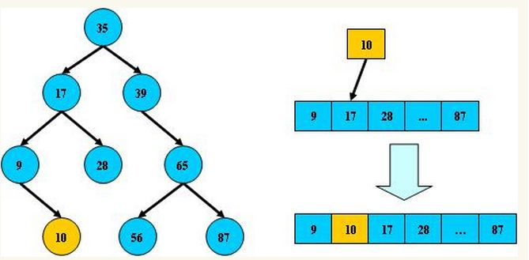

### 一、平衡二叉树

#### 1. 概念

AVL树是带有平衡条件的二叉查找树。**它要求在AVL树中任何节点的两个子树的高度(高度是指节点到一片树叶的最长路径的长) 最大差别为1**。

#### 2. 特点：

平衡二叉树是采用二分法思维把数据按规则组装成一个树形结构的数据，用这个树形结构的数据减少无关数据的检索，大大的提升了数据检索的速度；平衡二叉树的数据结构组装过程有以下规则：

1. 非叶子节点只能允许最多两个子节点存在。
2. 每一个非叶子节点数据分布规则为左边的子节点小当前节点的值，右边的子节点大于当前节点的值(这里值是基于自己的算法规则而定的，比如hash值)；

平衡树的层级结构：因为平衡二叉树查询性能和树的层级（h高度）成反比，h值越小查询越快、为了保证树的结构左右两端数据大致平衡降低二叉树的查询难度一般会采用一种算法机制实现节点数据结构的平衡，实现了这种算法的有比如Treap、红黑树，使用平衡二叉树能保证数据的左右两边的节点层级相差不会大于1，通过这样避免树形结构由于删除增加变成线性链表影响查询效率，保证数据平衡的情况下查找数据的速度近于二分法查找；

总结：

1. 非叶子节点最多拥有两个子节点；
2. 非叶子节值大于左边子节点、小于右边子节点；
3. 树的左右两边的层级数相差不会大于1；
4. 没有值相等重复的节点；

#### 3. 添加节点

当我们执行插入一个节点时，很可能会破坏AVL树的平衡特性，所以我们需要调整AVL树的结构，使其重新平衡，而调整的方式称之为**旋转**。

这里我们**针对父节点的位置**分为**左-左**，**左-右**，**右-右**，**右-左**这4类情况分析，而对**左-左**，**右-右**情况进行**单旋转**，也就是一次旋转，对**左-右**，**右-左**情况进行**双旋转**，两次旋转，最终恢复其平衡特性。

- 左左

  

- 左右

  

- 右右

  

- 右左

  

#### 4. 节点删除

对于二叉平衡树的删除节点操作，可以分成两步：

1. 删除节点，并且保证依然是一棵二叉排序树
2. 对二叉平衡树进行调整，保证是一棵平衡二叉树

对于第二步，在将删除节点和插入节点导致的非平衡问题中，最小非平衡子树类型的判断方法进行了统一后，实际上，对删除节点导致失衡问题的调整和对于添加节点导致的失衡问题的调整，方法也就统一了！

**所以重点在第一步，即：删除节点，并且保证依然是一棵二叉排序树。**

当删除一个节点时，该节点的孩子们怎么分配十分关键，因为要保证依然是一棵二叉排序树。

根据待删除节点的孩子的分布特点，可以将待删除节点分成三种类型，我们设待删除的节点为todelete：

1.  todelete没有孩子，这种情况最简单了，直接把它删了就好，因为它没有孩子要分配。
2. todelete只有一个孩子，这种情况也比较简单，用这个唯一的孩子将todelete取代了就好，所谓子承父业。
3.  todelete有两个孩子，这种情况就比较复杂了。俗话说一碗水端不平，究竟将自己的皇位传给哪个孩子呢？这可是个严肃的问题！中国古代讲究宗法制，血统很重要，按照宗法制，皇位最合法的继承者就是嫡长子！那在二叉排序树中谁是todelete的嫡长子呢？答案是todelete的后继节点，也就是比todelete大的节点中的最小的那一个！看到了吧，为什么当初起名字的时候要叫它后继节点呢。人家是要继承皇位哒！
   太子继承了皇位，那太子的位置就空了，这个时候就需要有人来继承太子的位置，那个人就是原太子的右孩子。好把，我们形式化一下，设todelete的后继节点为y，y的右孩子为x（注意y是没有左孩子的，因为如果存在左孩子那他的左孩子就是后继节点，继承皇位就没他什么事儿啦！）。这个时候，如果x为NULL那么，将todelete用y的替换，然后释放原来的y空间即可。如果x存在，那么用y替换了todelete后，还要用x替换y，然后释放原来x的空间，也就是太子成为皇帝，太子的儿子成为太子，然后太子的儿子的位置就空了，空了就清理了！

### 二、B/B-树

#### 1. 概念

B树和平衡二叉树稍有不同的是B树属于多叉树又名平衡多路查找树（查找路径不只两个）。

#### 2. 规则

- 排序方式：所有节点关键字是按递增次序排列，并遵循左小右大原则；
- 子节点数：非叶节点的子节点数>1，且<=M ，且M>=2，空树除外（注：M阶代表一个树节点最多有多少个查找路径，M=M路,当M=2则是2叉树,M=3则是3叉）；
- 关键字数：枝节点的关键字数量大于等于ceil(m/2)-1个且小于等于M-1个（注：ceil()是个朝正无穷方向取整的函数 如ceil(1.1)结果为2）；
- 所有叶子节点均在同一层、叶子节点除了包含了关键字和关键字记录的指针外也有指向其子节点的指针只不过其指针地址都为null对应下图最后一层节点的空格子;

#### 3. B树的查询流程：

如上图我要从上图中找到E字母，查找流程如下：

- 获取根节点的关键字进行比较，当前根节点关键字为M，E<M（26个字母顺序），所以往找到指向左边的子节点（二分法规则，左小右大，左边放小于当前节点值的子节点、右边放大于当前节点值的子节点）；
- 拿到关键字D和G，D<E<G 所以直接找到D和G中间的节点；
- 拿到E和F，因为E=E 所以直接返回关键字和指针信息（如果树结构里面没有包含所要查找的节点则返回null）；

#### 4. B树的插入节点流程

定义一个5阶树（平衡5路查找树;），现在我们要把3、8、31、11、23、29、50、28 这些数字构建出一个5阶树出来；

遵循规则：

- 节点拆分规则：当前是要组成一个5路查找树，那么此时m=5,关键字数必须<=5-1（这里关键字数>4就要进行节点拆分）；
- 排序规则：满足节点本身比左边节点大，比右边节点小的排序规则；

先插入 3、8、31、11

再插入23、29

再插入50、28

#### 5. B树节点的删除

规则

- 节点合并规则：当前是要组成一个5路查找树，那么此时m=5,关键字数必须大于等于ceil（5/2）（这里关键字数<2就要进行节点合并）；
- 满足节点本身比左边节点大，比右边节点小的排序规则；
- 关键字数小于二时先从子节点取，子节点没有符合条件时就向向父节点取，取中间值往父节点放；

#### 6. 特点

B树相对于平衡二叉树的不同是，每个节点包含的关键字增多了，特别是在B树应用到数据库中的时候，数据库充分利用了磁盘块的原理（磁盘数据存储是采用块的形式存储的，每个块的大小为4K，每次IO进行数据读取时，同一个磁盘块的数据可以一次性读取出来）把节点大小限制和充分使用在磁盘快大小范围；把树的节点关键字增多后树的层级比原来的二叉树少了，减少数据查找的次数和复杂度。

### 三、B+树

#### 1. 概念

B+树是B树的一个升级版，相对于B树来说B+树更充分的利用了节点的空间，让查询速度更加稳定，其速度完全接近于二分法查找。

#### 2. 规则

- B+跟B树不同B+树的**非叶子**节点不保存关键字记录的指针，只进行数据索引，这样使得B+树每个**非叶子**节点所能保存的关键字大大增加；
- B+树**叶子**节点保存了父节点的所有关键字记录的指针，所有数据地址必须要到叶子节点才能获取到。所以每次数据查询的次数都一样；
- B+树叶子节点的关键字从小到大有序排列，左边结尾数据都会保存右边节点开始数据的指针。
- 非叶子节点的子节点数=关键字数（来源百度百科）（根据各种资料 这里有两种算法的实现方式，另一种为非叶节点的关键字数=子节点数-1（来源维基百科)，虽然他们数据排列结构不一样，但其原理还是一样的Mysql 的B+树是用第一种方式实现）;

#### 3. 特点

- B+**树的层级更少**：相较于B树B+每个**非叶子**节点存储的关键字数更多，树的层级更少所以查询数据更快；
- B+**树查询速度更稳定**：B+所有关键字数据地址都存在**叶子**节点上，所以每次查找的次数都相同所以查询速度要比B树更稳定；
- B+**树天然具备排序功能：**B+树所有的**叶子**节点数据构成了一个有序链表，在查询大小区间的数据时候更方便，数据紧密性很高，缓存的命中率也会比B树高。
- B+**树全节点遍历更快：**B+树遍历整棵树只需要遍历所有的**叶子**节点即可，，而不需要像B树一样需要对每一层进行遍历，这有利于数据库做全表扫描。

#### 4. 比较

**B树**相对于**B+树**的优点是，如果经常访问的数据离根节点很近，而**B树**的**非叶子**节点本身存有关键字其数据的地址，所以这种数据检索的时候会要比**B+树**快。

