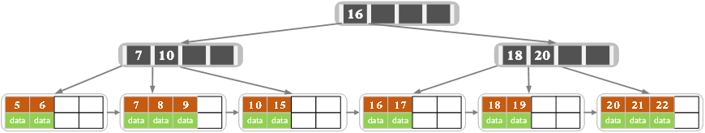
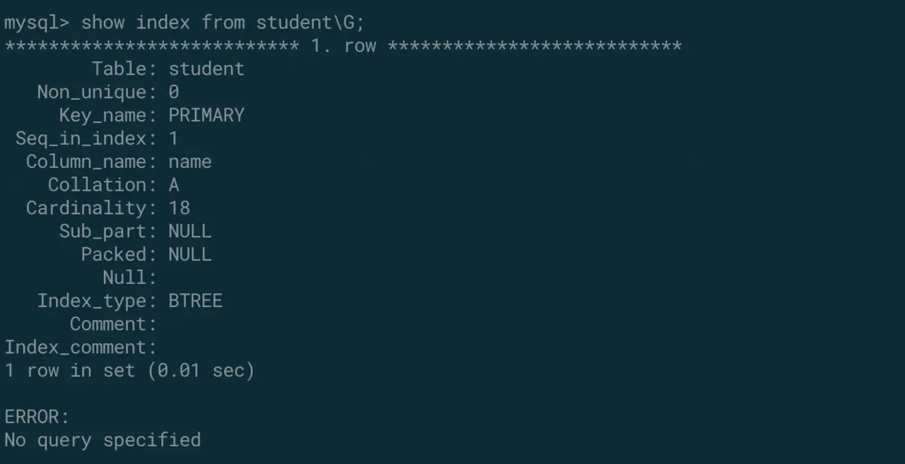

### 一. MySQL索引原理

```text
索引是存储引擎用于快速找到记录的一种数据结构。
```

这是MySQL官方对于索引的定义，可以看到索引是一种数据结构

#### 索引目的

索引的目的在于提高查询效率，可以类比字典，如果要查“mysql”这个单词，我们肯定需要定位到m字母，然后从下往下找到y字母，再找到剩下的sql。如果没有索引，那么你可能需要把所有单词看一遍才能找到你想要的，如果我想找到m开头的单词呢？或者ze开头的单词呢？是不是觉得如果没有索引，这个事情根本无法完成？

#### 索引原理

除了词典，生活中随处可见索引的例子，如火车站的车次表、图书的目录等。它们的原理都是一样的，通过不断的缩小想要获得数据的范围来筛选出最终想要的结果，同时把随机的事件变成顺序的事件，也就是我们总是通过同一种查找方式来锁定数据。

数据库也是一样，但显然要复杂许多，因为不仅面临着等值查询，还有范围查询(>、<、between、in)、模糊查询(like)、并集查询(or)等等。数据库应该选择怎么样的方式来应对所有的问题呢？我们回想字典的例子，能不能把数据分成段，然后分段查询呢？最简单的如果1000条数据，1到100分成第一段，101到200分成第二段，201到300分成第三段……这样查第250条数据，只要找第三段就可以了，一下子去除了90%的无效数据。但如果是1千万的记录呢，分成几段比较好？稍有算法基础的同学会想到搜索树，其平均复杂度是lgN，具有不错的查询性能。但这里我们忽略了一个关键的问题，复杂度模型是基于每次相同的操作成本来考虑的，数据库实现比较复杂，数据保存在磁盘上，而为了提高性能，每次又可以把部分数据读入内存来计算，因为我们知道访问磁盘的成本大概是访问内存的十万倍左右，所以简单的搜索树难以满足复杂的应用场景。

#### 磁盘IO与预读

前面提到了访问磁盘，那么这里先简单介绍一下磁盘IO和预读，磁盘读取数据靠的是机械运动，每次读取数据花费的时间可以分为寻道时间、旋转延迟、传输时间三个部分，寻道时间指的是磁臂移动到指定磁道所需要的时间，主流磁盘一般在5ms以下；旋转延迟就是我们经常听说的磁盘转速，比如一个磁盘7200转，表示每分钟能转7200次，也就是说1秒钟能转120次，旋转延迟就是1/120/2 = 4.17ms；传输时间指的是从磁盘读出或将数据写入磁盘的时间，一般在零点几毫秒，相对于前两个时间可以忽略不计。那么访问一次磁盘的时间，即一次磁盘IO的时间约等于5+4.17 = 9ms左右，听起来还挺不错的，但要知道一台500 -MIPS的机器每秒可以执行5亿条指令，因为指令依靠的是电的性质，换句话说执行一次IO的时间可以执行40万条指令，数据库动辄十万百万乃至千万级数据，每次9毫秒的时间，显然是个灾难。

考虑到磁盘IO是非常高昂的操作，计算机操作系统做了一些优化，当一次IO时，不光把当前磁盘地址的数据，而是把相邻的数据也都读取到内存缓冲区内，因为局部预读性原理告诉我们，当计算机访问一个地址的数据的时候，与其相邻的数据也会很快被访问到。每一次IO读取的数据我们称之为一页(page)。具体一页有多大数据跟操作系统有关，一般为4k或8k，也就是我们读取一页内的数据时候，实际上才发生了一次IO，这个理论对于索引的数据结构设计非常有帮助。

#### 索引的数据结构

前面讲了生活中索引的例子，索引的基本原理，数据库的复杂性，又讲了操作系统的相关知识，目的就是让大家了解，任何一种数据结构都不是凭空产生的，一定会有它的背景和使用场景，我们现在总结一下，我们需要这种数据结构能够做些什么，其实很简单，那就是：每次查找数据时把磁盘IO次数控制在一个很小的数量级，最好是常数数量级。那么我们就想到如果一个高度可控的多路搜索树是否能满足需求呢？就这样，b+树应运而生。



##### b+树的查找过程

如图所示，如果要查找数据项19，那么首先会把磁盘块1由磁盘加载到内存，此时发生一次IO，在内存中用二分查找确定19在16的右边，锁定磁盘块1中16记录右边的指针(P2)，内存时间因为非常短（相比磁盘的IO）可以忽略不计，通过磁盘块1的P2指针的磁盘地址把磁盘块3由磁盘加载到内存，发生第二次IO，19在18和20之间，锁定磁盘块3的P2指针，通过指针加载磁盘块8到内存，发生第三次IO，同时内存中做二分查找找到19，结束查询，总计三次IO。真实的情况是，3层的b+树可以表示上百万的数据，如果上百万的数据查找只需要三次IO，性能提高将是巨大的，如果没有索引，每个数据项都要发生一次IO，那么总共需要百万次的IO，显然成本非常非常高。

##### b+树性质

1. 通过上面的分析，我们知道IO次数取决于b+数的高度h，假设当前数据表的数据为N，每个磁盘块的数据项的数量是m，则有h=㏒(m+1)N，当数据量N一定的情况下，m越大，h越小；而m = 磁盘块的大小 / 数据项的大小，磁盘块的大小也就是一个数据页的大小，是固定的，如果数据项占的空间越小，数据项的数量越多，树的高度越低。这就是为什么每个数据项，即索引字段要尽量的小，比如int占4字节，要比bigint8字节少一半。这也是为什么b+树要求把真实的数据放到叶子节点而不是内层节点，一旦放到内层节点，磁盘块的数据项会大幅度下降，导致树增高。当数据项等于1时将会退化成线性表。
2. 当b+树的数据项是复合的数据结构，比如(name,age,sex)的时候，b+数是按照从左到右的顺序来建立搜索树的，比如当(张三,20,F)这样的数据来检索的时候，b+树会优先比较name来确定下一步的所搜方向，如果name相同再依次比较age和sex，最后得到检索的数据；但当(20,F)这样的没有name的数据来的时候，b+树就不知道下一步该查哪个节点，因为建立搜索树的时候name就是第一个比较因子，必须要先根据name来搜索才能知道下一步去哪里查询。比如当(张三,F)这样的数据来检索时，b+树可以用name来指定搜索方向，但下一个字段age的缺失，所以只能把名字等于张三的数据都找到，然后再匹配性别是F的数据了， 这个是非常重要的性质，即索引的最左匹配特性。


### 二. 索引能为我们带来什么?

如上面所说，索引能帮助我们快速的查找到数据。其次因为索引中的值是顺序储存，那么可以帮助我们进行order by操作。而且索引中也是存储了真正的值的，因此有一些的查询直接可以在索引中完成(也就是覆盖索引的概念，后面会提到)。

总结一下索引的优点就是(《高性能》书中总结的)：

- 减少查询需要扫描的数据量(加快了查询速度)
- 减少服务器的排序操作和创建临时表的操作(加快了groupby和orderby等操作)
- 将服务器的随机IO变为顺序IO(加快查询速度)

索引有哪些缺点呢？

首先索引也是数据，也需要存储，因此会带来额外的存储空间占用。其次，在插入，更新和删除操作的同时，需要维护索引，因此会带来额外的时间开销。

总结一下：

- 索引占用磁盘或者内存空间
- 减慢了插入更新操作的速度

实际上，在一定数据范围内(索引没有超级多的情况下)，建立索引带来的开销是远远小于它带来的好处的，但是我们仍然要防止索引的滥用。


### 三. 索引的几大原则

1. 最左前缀匹配原则，非常重要的原则，mysql会一直向右匹配直到遇到范围查询(>、<、between、like)就停止匹配，比如a = 1 and b = 2 and c > 3 and d = 4 如果建立(a,b,c,d)顺序的索引，d是用不到索引的，如果建立(a,b,d,c)的索引则都可以用到，a,b,d的顺序可以任意调整。
2. =和in可以乱序，比如a = 1 and b = 2 and c = 3 建立(a,b,c)索引可以任意顺序，mysql的查询优化器会帮你优化成索引可以识别的形式。
3. 尽量选择区分度高的列作为索引，区分度的公式是count(distinct col)/count(*)，表示字段不重复的比例，比例越大我们扫描的记录数越少，唯一键的区分度是1，而一些状态、性别字段可能在大数据面前区分度就是0，那可能有人会问，这个比例有什么经验值吗？使用场景不同，这个值也很难确定，一般需要join的字段我们都要求是0.1以上，即平均1条扫描10条记录。
4. 索引列不能参与计算，保持列“干净”，比如from_unixtime(create_time) = ’2014-05-29’就不能使用到索引，原因很简单，b+树中存的都是数据表中的字段值，但进行检索时，需要把所有元素都应用函数才能比较，显然成本太大。所以语句应该写成create_time = unix_timestamp(’2014-05-29’)。
5. 尽量的扩展索引，不要新建索引。比如表中已经有a的索引，现在要加(a,b)的索引，那么只需要修改原来的索引即可。


### 四. 都有哪些类型的索引?

对于MySQL来说,在服务器层并不实现索引,而是交给存储引擎来实现的,因此不同的存储引擎实现的索引类型不太一样.InnoDB作为当前使用最为广泛的存储引擎,使用的是B+树索引,因此我们大部分时间提到的索引也都是指的它.

MySQL主要有以下几种索引:

- B-树索引/B+树索引
- 哈希索引
- 空间数据索引
- 全文索引


### 五. 前缀索引

在对一个比较长的字符串进行索引时，可以仅索引开始的一部分字符，这样可以大大的节约索引空间，从而提高索引效率。但是这样也会降低索引的选择性。

索引的选择性：不重复的值/所有的值。可以看出索引的选择性为`0-1`，最高的就是该列唯一，没有重复值。所以唯一索引的效率是比较好的。

但是在一般情况下，较长的字符串的一些前缀的选择性也是比较好的，这个我们可以算出来。使用下面的语句：

```sql
select 
    count(distinct left(school_name,3))/count(*) as sch3, 
    count(distinct left(school_name,4))/count(*) as sch4,
    count(distinct left(school_name,5))/count(*) as sch5,
    count(distinct school_name)/count(*) as original
from 
    user;
```

其中查找到的`original`就是原本的选择性，`sch3,sch4,sch5`分别是取该列的前3,4,5个字符作为索引的时候的选择性。逐步增加这个数值，当选择性与原来相差不大的时候，就是一个比较合适的前缀索引的长度。(一般情况下是这样,但是也有例外,当数据极其不均匀时,这样的前缀索引会在某个特殊的case上表现很差劲)。

找到合适的长度之后，就可以创建一个前缀索引了：`alter table user add index sch_pre3(school(3))`


### 六. 覆盖索引

当一个索引包含(或者说是覆盖)需要查询的所有字段的值时，我们称之为覆盖索引。

设想有如下的查询语句：

```sql
select 
  school_name
from  
  user
where 
  school_name = '金色莺尾花学院'
```

这个语句根据学校名称来查询数据行的学校名称和年龄，从上面的数据查询的步骤我们可以知道，当在索引中找到要求的值的时候，还需要根据主键去进行一次索引，以拿到全部的数据，然后从其中挑选出需要的列，返回。但是现在索引中已经包含了所有的需要返回的列，那么就不用进行回数据表查询的操作了，此外索引的大小一般是远远小于真正的数据大小的，覆盖索引可以极大的减少从磁盘加载数据的数量。

**注：前缀索引和覆盖索引无法一起**

因为前缀索引的目的是用前缀来代表真正的值，他们在选择性上几乎没有区别，但是MySQL仍然无法判断真正的数据是什么，比如`阿里巴巴`和`阿里妈妈`在前缀为2的时候是一样的，但是为了确保你查询阿里巴巴的时候不会出现阿里妈妈的内容，是需要回到数据表拿到数据再次进行一个精准匹配来进行过滤的。


### 七. 联合索引

一般我们都是有`对多个列进行索引`的需求的,因为查询的需求多种多样。这个时候我们可以选择建立多个独立的索引或者建立一个联合索引。大多数时候都是联合索引更加合适一些。

假设我们要执行这个语句：`select * from user where school_name = '卡塞尔' and age > 20`，我们在`school`和`age`上分别建立两个独立的索引,那么我们预期这条查询语句会命中两个索引，但是使用explain命令查看会发现不一定。这是一个玄学的过程。

从理论上来讲，MySQL在5.0之后的版本里面对支持合并索引，也就是同时使用两个索引，但是MySQL的优化器不一定这样认为，他可能会认为，`查询两次B+树的代价高于查询一次索引之后去数据表进行过滤`，因此会选择只用一个索引。

不是字段上有索引，mysql就会用到索引，在处理查询的时候，mysql会根据你的sql语句，内部优化一版sql用于最终的查询。就比如上边的例子：age>20，当存贮的数据age 90%都是大于20的，mysql会认为，这个查询没必要走索引，就会放弃走索引，当然只是举个例子。

创建联合索引的语法：`alter table user add index school_age(school,age)`。

使用联合索引的时候，有一个非常重要的因素就是所有的索引列只可以进行最左前缀匹配，例如上面的`school_age`联合索引，当仅使用age作为查询条件的时候是不能使用的，也就是说`select * from user where age =20`是不能命中上面的联合索引的。

在不考虑任何查询的情况下，我们应该将选择性高的列放在联合索引的前面，但是实际上我们更多的是`通过查询来反推索引，以使某个固定的查询可以尽可能的命中索引以提高查询速度。`毕竟我们建立索引的目的也是为了加快查询的速度。

因此联合索引的优化更多的是根据某个或者某些语句来优化的，不具备一个通用的法则。

**最左前缀索引的原理**

当数据列有序的时候，mysql可以使用索引，那么假设我们建立了`school_age`索引,示例数据如下：

| school | age  |
| ------ | ---- |
| a      | 12   |
| b      | 13   |
| b      | 14   |
| b      | 15   |
| c      | 10   |

在这份数据中，school字段是完全有序的，索引school可以使用索引。

而从全表来看，age字段不是有序的，因此无法直接使用索引，那么观察一下数据表，在什么时候age有序呢？在school进行定值匹配的时候，例如当`school=b`的时候，对于这三条数据而言，age是有序的，因此可以使用age索引。这就是最左前缀的原理。

此外，最左前缀索引只能使用一个范围查询，例如`select * from user where school > a`，`select * from user where school = a and age > 12`，都是可以命中索引的，但是`select * from user where school > a and age > 12`中，仅school可以命中索引，这也可以从上面得出结论。因为当school是范围匹配的时候，mysql无法确认age字段是否严格有序，比如 school的范围匹配命中了b,c的四条数据，那么age就不是有序的。无法使用后续的索引。


### 八. 聚簇索引

聚簇索引不是一种索引类型，而是一种存储数据的方式。Innodb的聚簇索引是在同一个数据结构中保存了索引和数据。

因为数据真正的数据只能有一种排序方式，所以一个表上只能有一个聚簇索引。Innodb使用主键来进行聚簇索引，没有主键的话就会选择一个唯一的非空索引，如果还还没有，innodb会选择生成一个隐式的主键来进行聚簇索引。为什么innodb这么执着的需要搞一个聚簇索引呢，因为一个数据表中的数据总得有且只有一种排序方式来存储在磁盘上，因此这是必须的。

这也是innodb推荐我们使用自增主键的原因，因为自增主键自增且连续，在插入的时候只需要不断的在数据后面追加即可。设想一下使用UUID来作为主键，那么每一次的插入操作，都需要找到当前主键在已排序的主键中的位置，然后插入，并且要移动该主键后的数据，以使得数据和主键保持相同的顺序，这无疑是代价非常高的。

也是因为这个原因，在其他索引的叶子节点中，存储的"数据"其实不是该数据的真实物理地址，而是该数据的主键，查找到主键之后，再根据主键进行一次索引，拿到数据。

聚簇索引和非聚簇索引的区别可以用一个简单的例子来说明：

当我们拿到一本书的时候，目录就是主键，是一个聚簇索引，因为在目录中连续的内容，在正文中也是连续的，当我们想要查看`迎着阳光盛大逃亡`章节，只需要在目录中找到它对应的页面，比如459，然后去对应的页码查看正文即可。

而非聚簇索引呢，则类似于书后面的附录**专有名词索引**一样(二级普通索引)，当你查找`邦达列夫`的时候，附录会告诉你，这个名词出现在了`迎着阳光盛大逃亡`一节，然后你需要去目录(主键索引)中再次查找到对应的页码。


### 九. 怎样创建高性能的索引?

**前缀索引和索引选择性**

如果希望给一个很长的字符串上添加索引，那么可以考虑使用前缀索引。在正式介绍前缀索引之前，我们先大概考虑一下索引的工作步骤，数据库使用索引进行查找的时候，一般是如下几步：

1. 在索引的B+树上找到对应的值，比如找到学校名称为`卡塞尔学院`的一条记录，并且拿到这条数据在磁盘上的地址。
2. 根据地址去磁盘上查找，拿到该条数据所有的值。

那么假如在所有的学校名称的值中，`卡塞尔`就可以唯一的标识这条数据，那么用`卡塞尔`来做索引是否可以达到和`卡塞尔学院`做索引相同的效果？

答案是肯定的，而使用`卡塞尔`的话，是可以减少索引的大小到原来的60%的。这就是前缀索引的作用。

**删除掉冗余和重复的索引**

有一些索引是从未在查询中使用过，却白白增加数据插入时开销的，对于这种索引我们应该及时的进行删除。

比如在主键上再建立一个普通索引，无疑是毫无作用的。

还比如在有联合索引`school_age`的情况下，再建立一个`school`的独立索引，因为索引的最左前缀匹配原则，`school_age`是完全可以命中对`school`的单独查询的,因此后者可以删掉。


### 十. 如何查看索引的一些相关信息?

#### 索引信息

在mysql中可以使用`show index from table_name`来查看某个表上的索引，它将会有如下的输出：



或者使用`show create table table_name`来查看建表语句，其中包含创建索引的语句。

#### 索引大小

在5.0以后的版本中，我们可以通过查看`information_schema.TABLES`表中的数据来获取更加详细的数据。

该表各字段的含义如下表：

| 字段            | 含义                       |
| --------------- | -------------------------- |
| Table_catalog   | 数据表登记目录             |
| Table_schema    | 数据表所属的数据库名       |
| Table_name      | 表名称                     |
| Table_type      | 表类型[system view         |
| Engine          | 使用的数据库引擎[MyISAM    |
| Version         | 版本，默认值10             |
| Row_format      | 行格式[Compact             |
| Table_rows      | 表里所存多少行数据         |
| Avg_row_length  | 平均行长度                 |
| Data_length     | 数据长度                   |
| Max_data_length | 最大数据长度               |
| Index_length    | 索引长度                   |
| Data_free       | 空间碎片                   |
| Auto_increment  | 做自增主键的自动增量当前值 |
| Create_time     | 表的创建时间               |
| Update_time     | 表的更新时间               |
| Check_time      | 表的检查时间               |
| Table_collation | 表的字符校验编码集         |
| Checksum        | 校验和                     |
| Create_options  | 创建选项                   |
| Table_comment   | 表的注释、备注             |

我们可以通过一些查询语句来获取详细的信息，比如：

```sql
// 查看当前MySQL服务器所有索引的大小(以MB为单位,默认是字节)
SELECT CONCAT(ROUND(SUM(index_length)/(1024*1024), 2), ' MB') AS 'Total Index Size' FROM TABLES
// 查看某一个库的所有大小
SELECT CONCAT(ROUND(SUM(index_length)/(1024*1024), 2), ' MB') AS 'Total Index Size' FROM TABLES  WHERE table_schema = 'XXX';
// 查看某一个表的索引大小
SELECT CONCAT(ROUND(SUM(index_length)/(1024*1024), 2), ' MB') AS 'Total Index Size' FROM TABLES  WHERE table_schema = 'yyyy' and table_name = "xxxxx";  
// 汇总查看一个库中的数据大小及索引大小
SELECT CONCAT(table_schema,'.',table_name) AS 'Table Name', CONCAT(ROUND(table_rows/1000000,4),'M') AS 'Number of Rows', CONCAT(ROUND(data_length/(1024*1024*1024),4),'G') AS 'Data Size', CONCAT(ROUND(index_length/(1024*1024*1024),4),'G') AS 'Index Size', CONCAT(ROUND((data_length+index_length)/(1024*1024*1024),4),'G') AS'Total'FROM information_schema.TABLES WHERE table_schema LIKE 'xxxxx';
```

注意：上面的表格是有缓存的，当更新数据库索引之后，最好执行`analyze table xxxx`，然后再进行查看。MySQL会在表格数据发生较大的变化时才更新此表(大小变化超过1/16或者插入20亿行)。

#### 索引碎片

在索引的创建删除过程中，不可避免的会产品索引碎片，当然还有数据碎片，我们可以通过执行`optimize table xxx`来重新整理索引及数据，对于不支持此命令的存储引擎来说，可以通过一条无意义的alter语句来触发整理，比如：将表的存储引擎更换为当前的引擎，`alter table xxxx engine=innodb`。