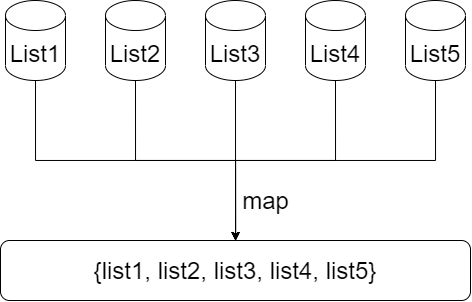

### 一、lambda表达式

lambda分为三部分：参数列表 箭头运算符 lambda体

```java
(x) -> System.out.println(x);

void methodName(x) {
    System.out.println(x);
}
```

格式：


```java
//无参数 无返回值 一行语句
Runnable
```

```java
//无参数 无返回值 多行语句
Runnable
```

```java
//无参数 有返回值 一行语句
Supplier<T>
```

```java
//无参数 有返回值 多行语句
Supplier<T>
```

```java
//一个参数 无返回值 一行语句
Consumer<T>
```

```java
//一个参数 无返回值 多行语句
Consumer<T>
```

```java
//一个参数 有返回值 一行语句
Function<T, R>
```

```java
//一个参数 有返回值 多行语句
Function<T, R>
```

```java
//多个参数 无返回值 一行语句
BiConsumer<T, U>
```

```java
//多个参数 无返回值 多行语句
BiConsumer<T, U>
```

```java
//多个参数 有返回值 一行语句
BiFunction<T, U, R>
```

```java
//多个参数 有返回值 多行语句
BiFunction<T, U, R>
```


### 二、流（Stream）是什么

是数据渠道，用于操作数据源（集合、数组等）所生成的元素序列。

“集合讲的是数据，流讲的是计算”


**注意**

1. Stream自己不会存储元素
2. Stream不会改变源对象。相反会返回一个持有新结果的新Stream
3. Stream操作是延迟执行的，也就是他们会等到需要结果的时候才执行


### 三、Stream操作的三个步骤

1. 创建stream

   一个数据源（集合、数组等），获取一个流

2. 中间操作

   一个中间操作链，对数据源的数据进行处理

3. 终止操作

   一个终止操作，执行中间操作链，并产生结果

   

**注：多个中间操作可以连接起来形成一个流水线，除非流水线上触发终止操作，否则中间操作不会执行任何的处理，而在终止操作时一次性全部处理，成为”惰性求值“**


### 四、map与flatMap

1. map

   

2. flatMap

   