### 1. Tomcat组件

#### 1.1 HTTP工作原理

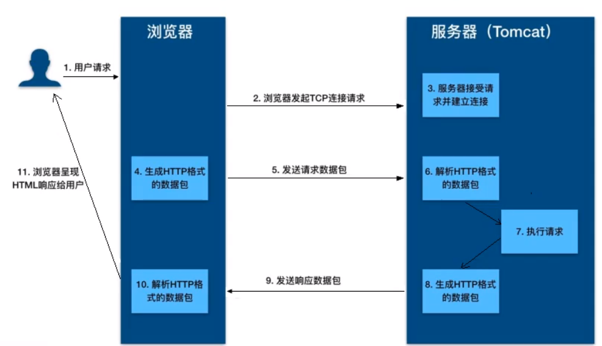

具体过程为：

- 用户通过浏览器进行了一个操作，浏览器获取了这个事件。
- 浏览器向服务器发出tcp连接请求
- 服务器程序接受请求，并经过tcp三次握手建立连接
- 浏览器将请求数据打包成为一个http协议格式的数据包
- 浏览器将数据包通过网络传输给服务器程序
- 程序拿到数据包后，以http协议格式解包
- 处理请求
- 将返回值以http协议格式打包
- 通过网络传输数据
- 浏览器解析返回值
- 将解析后的数据展示给用户

#### 1.2 Tomcat整体架构

##### 1.2.1 HTTP请求处理

方式一：HTTP请求直接调用java业务类

缺点：HTTP服务器中需要写很多的if else判断，去决定使用哪个业务类，耦合度高

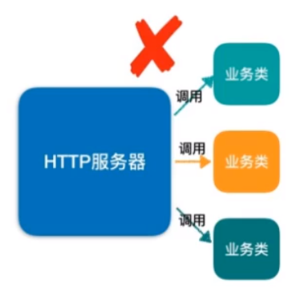

方式二：HTTP请求发到servlet容器，由容器来决定调用哪个业务类，实现了解耦的目的。servlet接口和servlet容器这一套规范叫做servlet规范。Tomcat按照servlet规范的要求实现了servlet容器，同时他也具有HTTP服务器的功能。作为开发者，我们如果需要实现新的功能，只需要实现一个servlet，并把它注册到Tomcat中就可以了。

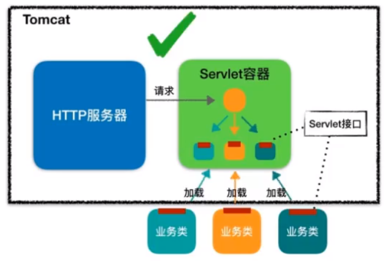

##### 1.2.2 Servlet容器工作流程

servlet作用：

- 定位servlet：根据请求的url和servlet的映射关系，找到对应的servlet
- 加载servlet
- 调用servlet

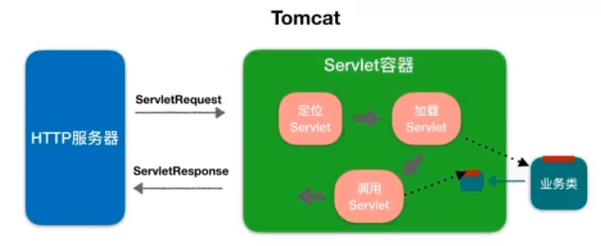

##### 1.2.3 Tomcat整体架构

Tomcat两个核心功能：

- 处理socket连接，负责网络字节流与request和response对象的转化
- 加载和管理servlet，以及处理request请求

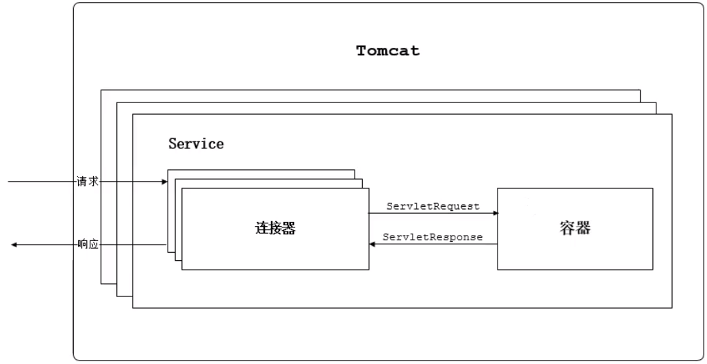

#### 1.3 连接器 Coyote

coyote是Tomcat的连接器架构。客户端通过coyote与服务器建立连接，发送请求并接收响应。

coyote封装了底层的网络协议，使catalina容器与具体的请求协议及IO操作方式完全解耦。

coyote将socket输入转换封装为request对象，交由catalina容器进行处理，处理请求完成后，catalina用过coyote提供的response对象将结果写入输出流。

coyote只负责具体协议和IO的相关操作，与servlet规范实现没有直接关系，

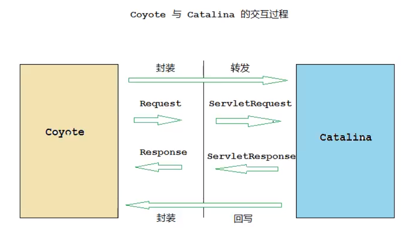

##### 1.3.1 IO模型与协议

Tomcat支持的IO模型（8.5版本之后，Tomcat移除了对BIO的支持）：

| IO模型 | 描述                                                         |
| ------ | ------------------------------------------------------------ |
| NIO    | 非阻塞IO，采用java NIO类库实现。                             |
| NIO2   | 异步IO，采用JDK7 NIO2类库实现。                              |
| APR    | 采用Apache可移植运行库实现，是C/C++编写的本地库。如果使用该方案，需要单独安装APR库 |

Tomcat支持的应用层协议：

| 应用层协议 | 描述                                                         |
| ---------- | ------------------------------------------------------------ |
| HTTP/1.1   | 大部分web应用采用的访问协议                                  |
| AJP        | 用于和web服务器集成，以实现对静态资源的优化以及集群部署，当前支持AJP/1.3 |
| HTTP/2     | HTTP2.0大幅度提升了web性能。自8.5以及9.0版本之后支持         |

##### 1.3.2 连接器组件

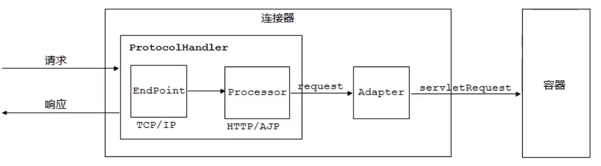

连接器中各组件作用如下：

###### EndPoint

- EndPoint：Coyote通信端口，即通信监听的接口，是socket接收和发送处理器，是对传输层的抽象，因此EndPoint用来实现TCP/IP协议。
- Tomcat中没有EndPoint接口，而是提供了一个抽象类AbstractEndPoint，定义了两个内部类：Acceptor和SocketProcessor。Acceptor用来监听socket连接请求；SocketProcessor用来处理接收到的socket请求，他实现了Runnable接口，在run方法里调用协议处理组件Processor进行处理。**为提供处理能力，SocketProcessor被提交到线程池来执行，而这个线程池叫做执行器（Executor）**

###### Processor

Coyote协议处理接口，Processor接收来自EndPoint的socket，读取字节流解析成Tomcat Request和Response对象，并通过Adapter将其提交到容器处理，Processor是对应用层协议的抽象。

###### ProtocolHandler

- ProtocolHandler是Coyote的协议接口，通过EndPoint和Processor，实现对具体协议的处理能力。Tomcat按照协议和IO类型提供了6个实现类：AjpNioProtocol、AjpAprProtocol、AjpNio2Protocol、Http11NioProtocol、Http11Nio2Protocol、Http11AprProtocol。
- 在配置tomcat/conf/server.xml时，至少要指定具体的ProtocolHandler，也可以指定协议名称，如：HTTP/1.1，如果安装了APR，那么将使用Http11AprProtocol，否则使用Http11NioProcotol。

###### Adapter

- 由于协议不同，客户端发过来的数据也不都一样，Tomcat定义了自己的Request类来存放这些请求信息。ProtocolHandler接口负责解析请求并生成Tomcat Request类。但是这个Request类并不遵循Servlet规范，也就意味着不能使用该类当做container的入参。
- Tomcat的解决方案是引入CoyoteAdapter，使用了适配器设计模式。
- 连接器调用CoyoteAdapter的service方法，传入Request对象，CoyoteAdapter将Request对象转化为遵循Servlet规范的ServletRequest对象，再去调用容器的service方法。

#### 1.4 容器 Catalina

##### 1.4.1 Catalina地位

Tomcat分层示意图：

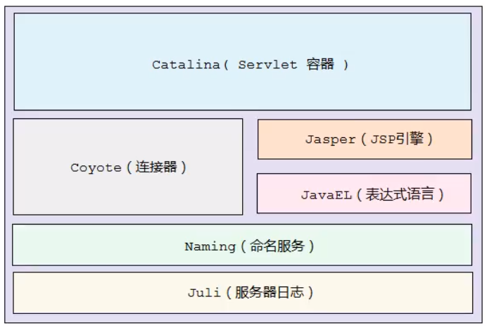

Tomcat本质上就是一款servlet容器，因此Catalina才是Tomcat的核心，其他模块都是为了Catalina提供支撑的。比如：通过Coyote模块提供链接通信，Jasper模块提供JSP引擎。

##### 1.4.2 Catalina结构

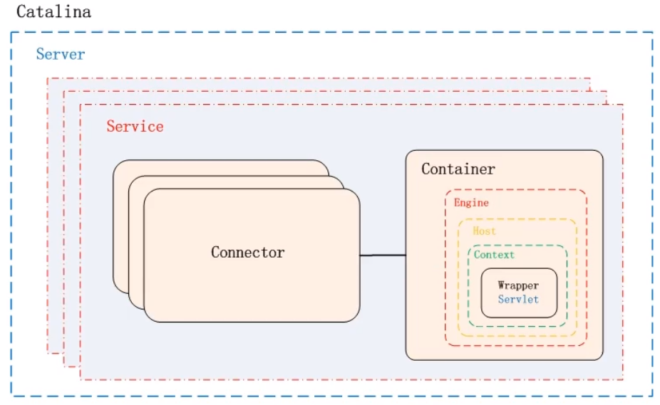

Catalina负责管理Server，而Server表示着整个服务器。Server下面有多个服务Service，每个服务都包含多个连接器（用于监听不同的网络协议）和一个容器。在Tomcat启动的时候，会初始化一个Catalina的实例。

| 组件      | 职责                                                         |
| --------- | ------------------------------------------------------------ |
| Catalina  | 负责解析Tomcat的配置文件，以此来创建服务器server组件，并根据命令来对其进行管理 |
| Server    | 服务器表示整个Catalina Servlet容器以及其他组件，负责组装并启动Servlet引擎，Tomcat连接器。Server通过实现Lifecycle接口，提供了启动和关闭整个系统的方式。 |
| Service   | 服务是Server内部的组件，一个Server包含多个Service。它将若干个连接器和一个容器进行绑定 |
| Connector | 连接器，处理与客户端的通信，他负责接收客户请求，然后转给相关的容器进行处理，最后向客户返回响应结果 |
| Container | 容器，负责处理用的servlet请求，并返回对象给web用户           |

##### 1.4.3 Container结构

Tomcat设计了4种容器，分别是Engine、Host、Context和Wrapper。

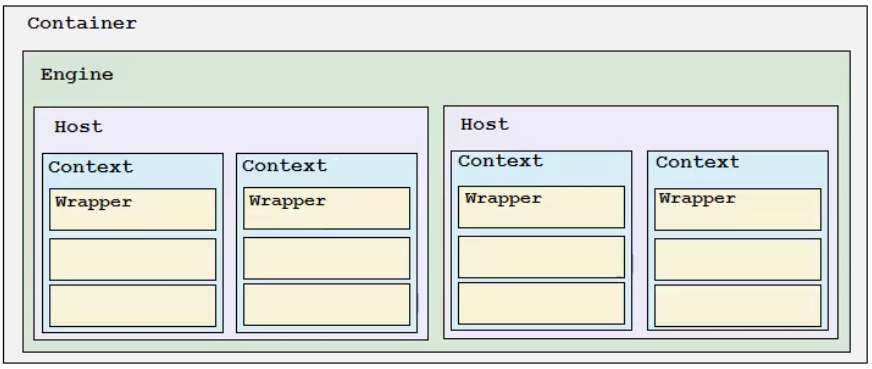

各个组件的含义：

| 容器    | 描述                                                         |
| ------- | ------------------------------------------------------------ |
| Engine  | 表示整个Catalina的servlet引擎，用来管理多个虚拟站点，一个service最多只能有一个Engine，但是一个引擎可包含多个Host |
| Host    | 代表一个虚拟主机，或者说是一个站点，可以给Tomcat配置多个虚拟主机地址，而一个虚拟主机下可包含多个Context |
| Context | 表示一个web应用程序，一个web应用可包含多个Wrapper            |
| Wrapper | 表示一个servlet，wrapper作为最底层容器，不能包含子容器       |

#### 1.5 Tomcat启动流程

##### 1.5.1 流程图

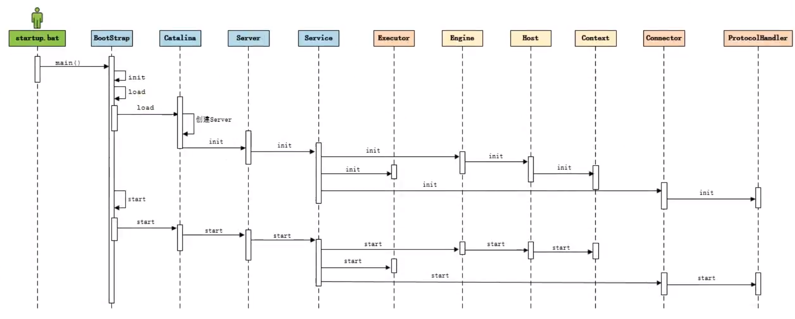

##### 1.5.2 源码解析

###### 1.5.2.1 Lifecycle

由于所有的接口都存在初始化、启动、停止等生命周期方法，拥有生命周期管理的特性，所以Tomcat在设计的时候，基于生命周期管理抽象成了一个接口Lifecycle，而组件server、service、container、executor、connector，都实现了一个生命周期的接口，从而有了以下声明周期中的核心方法：

- init()  初始化
- start()  启动
- stop()  停止
- destory()  销毁

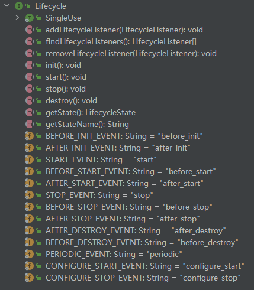

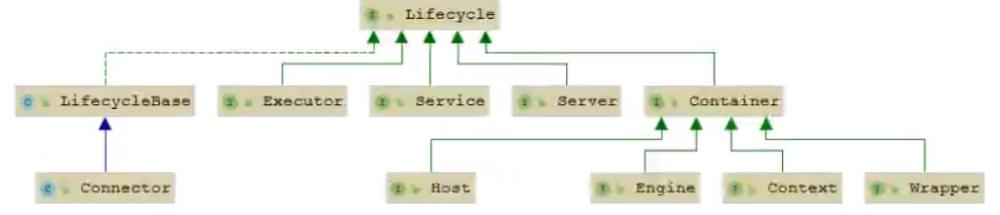

###### 2.5.2.2 各组件的默认实现

上面说到的server、service、container、executor、connector都是接口，下图为各接口的默认实现类。对于Endpoint组件来说，在Tomcat中没有对应的Endpoint接口，但是有一个抽象类AbstractEndpoint，其下有三个实现类：NioEndpoint、Nio2Endpoint、AprEndpoint，这三个实现类，分别对应coyote支持的三种io模型：NIO、NIO2、APR，Tomcat8.5中，默认采用的是NioEndpoint。

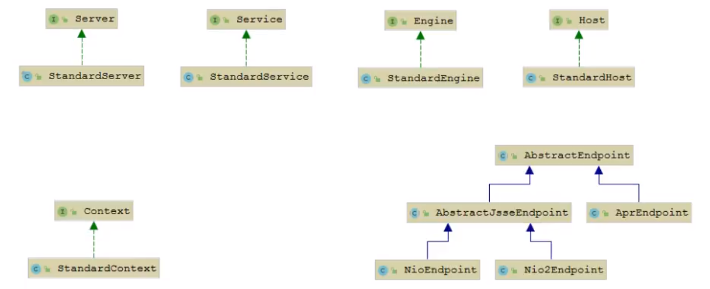

ProtocolHandler：coyote协议接口，通过封装Endpoint和Processor，实现针对具体协议的处理功能。Tomcat按照协议和io提供了6个实现类。

- AJP 协议：
  - AjpNioProtocol
  - AjpNio2Protocol
  - AjpAprProtocol
- HTTP 协议：
  - Http11NioProtocol（默认）
  - Http11Nio2Protocol
  - Http11AprProtocol

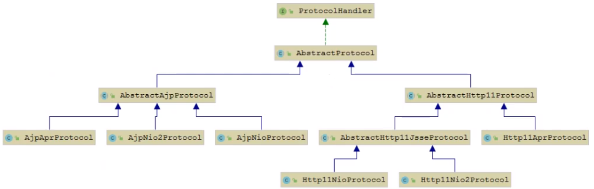

##### 1.5.3 总结

从启动流程图中以及源码中，可以看出Tomcat的启动过程非常的标准化，统一按照生命周期管理接口Lifecycle的定义进行启动。首先调用init()方法进行组件的逐级初始化操作，然后再调用start()方法进行启动。

每一级的组件除了完成自身的处理外，还要负责调用子组件相应的生命周期管理方法，组件与组件之间是松耦合的，因此如果需要拓展这些组件，只需要通过修改或替换配置文件即可完成。